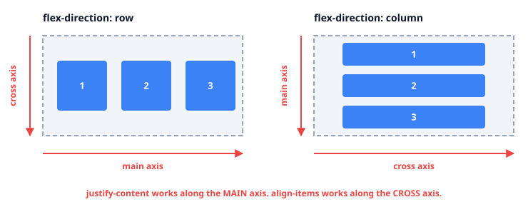
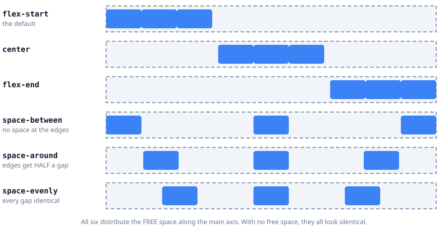
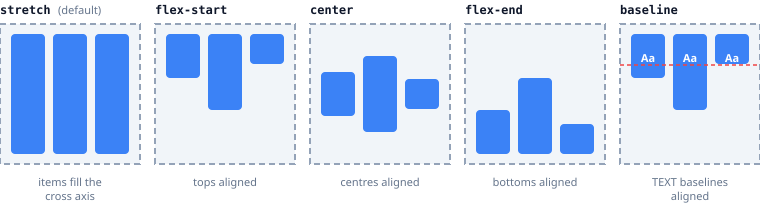
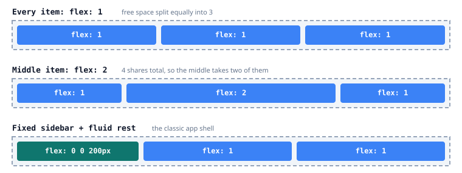
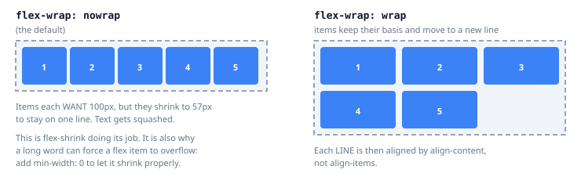

# 13 — Flexbox

> **The question this answers:** how do I arrange things along **one** line and control the leftover
> space?

Flexbox is **content-driven, one-dimensional** layout. You give it a row (or a column) of items and
it decides how to distribute the space that's left over. It does not know about the line above or
below — that's [grid's](14_CSS_Grid.md) job.

**Play with everything in this lesson:** open
[`playground/layout-playground.html`](playground/layout-playground.html) in a browser.

---

## The one concept everything depends on: the two axes

Every flex property is either about the **main axis** or the **cross axis**. Which is which depends
entirely on `flex-direction`.



| Property | Acts on | With `row` | With `column` |
| :--- | :--- | :--- | :--- |
| `justify-content` | main axis | horizontal | **vertical** |
| `align-items` | cross axis | vertical | **horizontal** |

Nearly every "why won't this centre?" bug is applying `justify-content` when you needed
`align-items`, because the direction is `column` and the axes have swapped.

```css
.container {
  display: flex;          /* children become flex items immediately */
  flex-direction: row;    /* the default */
}
```

---

## `justify-content` — space along the main axis



| Value | Behaviour | Typical use |
| :--- | :--- | :--- |
| `flex-start` | Packed at the start (default) | Normal content flow |
| `center` | Packed in the middle | Centred nav, empty states |
| `flex-end` | Packed at the end | Right-aligned actions |
| `space-between` | First and last touch the edges | Logo left, menu right |
| `space-around` | Each item gets equal space around it, so edges are half-sized | Rarely what you want |
| `space-evenly` | Every gap identical, including the edges | Evenly spread tabs |

The distinction people get wrong is `space-around` vs `space-evenly`: with `around`, the edge gaps
are **half** the size of the gaps between items, which looks subtly lopsided. `evenly` is usually
what was intended.

**These only do something when there is free space.** If the items already fill the container, all
six look the same — which is why this property sometimes appears to be ignored.

---

## `align-items` — position along the cross axis



The default is `stretch`, and that catches everyone at least once: flex items with no explicit
height stretch to match the tallest sibling. That's why a short card in a row of cards magically
becomes full height — and why it stops doing that the moment you set `align-items: center`.

`baseline` is the underrated one: it aligns the *text baselines* rather than the boxes, which is
exactly what you want when a heading sits next to a small label.

```css
/* the centring that actually works, both axes, three lines */
.center {
  display: flex;
  justify-content: center;   /* main axis  */
  align-items: center;       /* cross axis */
}
```

---

## `flex` on the items — who absorbs the leftover space?

The `flex` shorthand is three properties, and writing them separately is where confusion starts:

```css
flex: <grow> <shrink> <basis>;
flex: 1;            /* = 1 1 0%   — ignore my content, share space equally */
flex: auto;         /* = 1 1 auto — start from my content, then grow       */
flex: none;         /* = 0 0 auto — never grow, never shrink               */
flex: 0 0 200px;    /* exactly 200px, always                               */
```



| Value | Meaning |
| :--- | :--- |
| `flex-grow` | Share of **extra** space to absorb. `2` takes twice as much as `1` |
| `flex-shrink` | Share of **overflow** to give back. `0` means "never shrink me" |
| `flex-basis` | The starting size, before growing or shrinking |

The difference between `flex: 1` and `flex: auto` is the basis. With `flex: 1` the basis is `0`, so
items end up **equal width regardless of content**. With `flex: auto` the basis is the content
size, so a longer label yields a wider item. Choosing wrongly here is why "equal" columns come out
uneven.

---

## `flex-wrap` and the shrink trap



By default flex refuses to wrap and squeezes everything onto one line. Two consequences worth
knowing:

**1. The `min-width: auto` overflow bug.** A flex item won't shrink below its content's minimum
size, so one long word or a wide table blows out the layout instead of shrinking.

```css
.item {
  min-width: 0;        /* the fix — now it can actually shrink */
  overflow: hidden;    /* plus this if you need text-overflow: ellipsis */
}
```

This single declaration solves an enormous share of real-world flex bugs.

**2. Once you wrap, `align-items` is no longer the whole story.** `align-items` positions items
*within their line*; `align-content` positions the **lines themselves** within the container. If
wrapped rows are pinned to the top with space below, you want `align-content`.

---

## Item-level properties worth knowing

| Property | Effect |
| :--- | :--- |
| `order: -1` | Moves an item visually without moving it in the DOM |
| `align-self: center` | Overrides `align-items` for one item |
| `margin-left: auto` | Absorbs all free space to the left — pushes one item to the far end |

That last one is a genuinely useful trick:

```css
/* nav items on the left, "Sign out" pushed to the right, no extra wrapper */
.nav { display: flex; gap: 16px; }
.nav .signout { margin-left: auto; }
```

**A warning about `order`:** it changes the visual order only. Keyboard and screen-reader users
still follow the DOM order, so a reordered layout can produce a nonsensical tab sequence. Use it for
responsive tweaks, never to fix a wrong DOM.

---

## Common recipes

```css
/* Perfectly centred, any content size */
.hero { display: flex; justify-content: center; align-items: center; min-height: 100dvh; }

/* Header: logo left, actions right */
.header { display: flex; justify-content: space-between; align-items: center; }

/* Media object: fixed avatar, fluid text */
.media { display: flex; gap: 12px; }
.media__avatar { flex: 0 0 48px; }
.media__body  { flex: 1; min-width: 0; }

/* Sticky footer inside a card of unknown height */
.card { display: flex; flex-direction: column; height: 100%; }
.card__body   { flex: 1; }         /* body absorbs the slack   */
.card__footer { margin-top: auto; } /* or push the footer down  */

/* Toolbar that wraps gracefully on small screens */
.toolbar { display: flex; flex-wrap: wrap; gap: 8px; align-items: center; }
```

---

## Anti-patterns

| Anti-pattern | Why it hurts | Fix |
| :--- | :--- | :--- |
| Flexbox for a page-wide 2D layout | Rows can't align with each other | Use grid ([lesson 14](14_CSS_Grid.md)) |
| Margins for spacing between items | Fragile first/last-child exceptions | `gap` |
| Forgetting `min-width: 0` | Long content overflows the container | Add it to shrinking items |
| `flex: 1` when you meant `flex: auto` | Content-sized items come out equal-width | Pick the basis deliberately |
| `order` to fix DOM sequence | Breaks keyboard and screen-reader order | Fix the markup |
| Nesting five flex containers | Nobody can predict the sizing | One grid usually replaces three flexes |

---

## Exercises

**1.** Three cards in a `display: flex` row. One has less text but renders the same height as the
others, and you didn't set a height. Why?

<details><summary>Answer</summary>

`align-items` defaults to **`stretch`**, so every item is stretched to the height of the tallest
one along the cross axis. Nothing is setting a height — the default alignment is.

Keep it if you want equal-height cards (it's usually desirable). To stop it, set
`align-items: flex-start` on the container, or `align-self: flex-start` on the one item.
</details>

**2.** A flex row contains a text label and a long URL. The URL overflows the container and produces
a horizontal scrollbar instead of truncating. Fix it.

<details><summary>Answer</summary>

Flex items have an implicit `min-width: auto`, which prevents shrinking below the content's
intrinsic minimum. An unbreakable string like a URL therefore forces overflow.

```css
.url {
  min-width: 0;            /* allow shrinking below intrinsic width */
  overflow: hidden;
  text-overflow: ellipsis;
  white-space: nowrap;
}
```

`min-width: 0` is the load-bearing line; the other three only style the truncation. For a column
flex container the equivalent is `min-height: 0`.
</details>

**3.** You need a navigation bar where the first three links group on the left and the last two on
the right, without wrapper divs. How?

<details><summary>Answer</summary>

Use an auto margin as a spacer — it absorbs all free space at that position:

```css
.nav { display: flex; gap: 16px; align-items: center; }
.nav > :nth-child(4) { margin-left: auto; }
```

`justify-content: space-between` won't do it: that spreads all five links evenly rather than
splitting them into two groups. The auto margin puts all the free space at exactly one point.
</details>

---

**Next:** [14 — CSS Grid](14_CSS_Grid.md)
