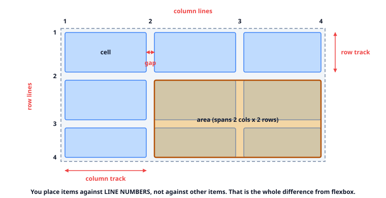
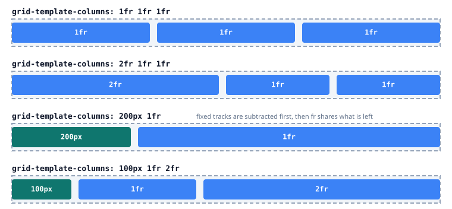
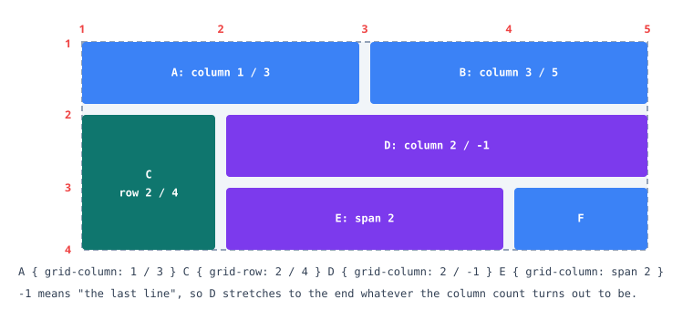
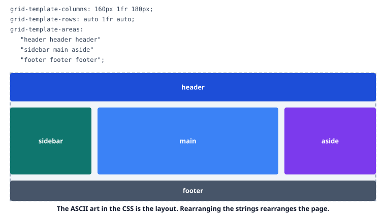
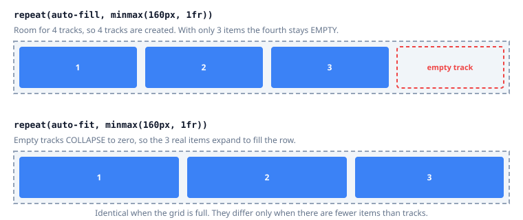
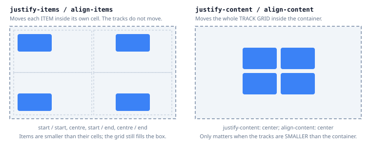
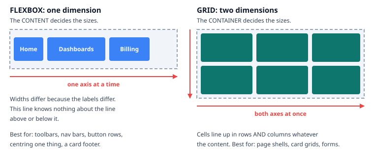

# 14 — CSS Grid

> **The question this answers:** how do I define a layout **up front** and drop content into it?

Grid is **layout-driven, two-dimensional**. You describe the rows and columns first, then place
items into them. Unlike [flexbox](13_Flexbox.md), the container decides the structure and the
content fits in — not the other way round.

**Play with everything here:** [`playground/layout-playground.html`](playground/layout-playground.html).

---

## Anatomy: lines, tracks, cells, areas

Grid's vocabulary is worth learning precisely, because the properties are named after it.



| Term | Meaning |
| :--- | :--- |
| **Line** | The numbered dividers. 3 columns means 4 column lines |
| **Track** | The space between two adjacent lines — a row or a column |
| **Cell** | One row track crossed with one column track |
| **Area** | Any rectangle of cells, spanning as many as you like |
| **Gap** | The gutter between tracks. Not a margin — it never collapses |

The key mental shift from flexbox: **items are positioned against line numbers**, not relative to
their siblings. That's what makes two-dimensional alignment possible.

---

## Defining tracks, and the `fr` unit

```css
.grid {
  display: grid;
  grid-template-columns: 1fr 1fr 1fr;   /* three equal columns */
  gap: 16px;
}
```

`fr` means "one share of the **remaining** space". Fixed tracks are subtracted first, then whatever
is left is divided among the `fr` values.



| Sizing | Meaning |
| :--- | :--- |
| `200px` | Fixed |
| `1fr` | One share of what's left |
| `auto` | As large as the content needs |
| `min-content` | The narrowest the content allows (longest word) |
| `max-content` | The widest the content wants (no wrapping) |
| `minmax(200px, 1fr)` | At least 200px, otherwise flexible |
| `repeat(3, 1fr)` | Shorthand for `1fr 1fr 1fr` |

**The `1fr` overflow gotcha:** `1fr` is really `minmax(auto, 1fr)`, so a track won't shrink below
its content — long text or a wide table can push the grid wider than its container. When that
happens, use `minmax(0, 1fr)`. This is grid's equivalent of flexbox's `min-width: 0`, and it
catches everyone once.

---

## Placing items across lines

```css
.hero    { grid-column: 1 / 3; }      /* from line 1 to line 3 = 2 tracks */
.sidebar { grid-row: 2 / 4; }         /* spans two rows                   */
.banner  { grid-column: 1 / -1; }     /* line 1 to the LAST line          */
.wide    { grid-column: span 2; }     /* 2 tracks, wherever it lands      */
```



`-1` is the most useful number in grid: it means "the last line", so `1 / -1` is a full-width item
regardless of how many columns exist. Use it for section headers and dividers inside a card grid.

---

## Named areas — the readable way to build a page shell

Instead of counting line numbers, name the regions and draw the layout in the CSS:

```css
.page {
  display: grid;
  grid-template-columns: 160px 1fr 180px;
  grid-template-rows: auto 1fr auto;
  grid-template-areas:
    "header  header  header"
    "sidebar main    aside"
    "footer  footer  footer";
  min-height: 100dvh;
  gap: 12px;
}
.page__header { grid-area: header; }
.page__main   { grid-area: main; }
```



| Advantages | Trade-offs |
| :--- | :--- |
| The CSS is a picture of the layout — reviewable at a glance | Every row must have the same number of columns |
| Responsive changes are one redrawn template | Names are global to that grid, so they must stay in sync |
| No line-number arithmetic to get wrong | Slightly verbose for simple two-column cases |

Restructuring for mobile becomes genuinely pleasant:

```css
@media (width < 700px) {
  .page {
    grid-template-columns: 1fr;
    grid-template-areas: "header" "main" "sidebar" "aside" "footer";
  }
}
```

Note that this also reorders regions visually — the same accessibility caveat as flexbox `order`
applies, so keep the DOM order sensible.

---

## Responsive without media queries

This is grid's best trick, and the reason card grids rarely need breakpoints any more:

```css
.cards {
  display: grid;
  grid-template-columns: repeat(auto-fit, minmax(240px, 1fr));
  gap: 20px;
}
```

Read it as: "as many columns as fit, each at least 240px, sharing any extra space". The column
count now responds to the **container's** width, at every size, with no breakpoints to maintain.



| | `auto-fill` | `auto-fit` |
| :--- | :--- | :--- |
| Empty tracks | Kept, reserving space | Collapsed to zero |
| 3 items in room for 4 | 3 items + one empty slot | 3 items stretched to fill |
| Use when | A consistent column rhythm matters | Items should always fill the row |

They behave identically when the grid is full, which is why the difference is easy to miss until a
sparse page looks wrong.

---

## Alignment: two pairs of properties

Grid has four alignment properties, and they split into two clear jobs.



| Property | Moves | Axis |
| :--- | :--- | :--- |
| `justify-items` | Each item inside its cell | Inline (horizontal) |
| `align-items` | Each item inside its cell | Block (vertical) |
| `justify-content` | The whole set of tracks inside the container | Inline |
| `align-content` | The whole set of tracks inside the container | Block |

`*-items` matters when items are **smaller than their cells**. `*-content` matters only when the
**tracks are smaller than the container** — with `1fr` columns there's no leftover space, so
`justify-content` appears to do nothing. That's the usual confusion.

Two shorthands worth memorising:

```css
place-items: center;      /* align-items + justify-items   */
place-content: center;    /* align-content + justify-content */

/* the shortest true centring in CSS */
.center { display: grid; place-items: center; }
```

---

## Flex or grid? A straight answer



| Use **flexbox** when | Use **grid** when |
| :--- | :--- |
| Content sizes should drive the layout | The container should impose the layout |
| One direction at a time | Rows and columns must align together |
| Item count is unknown or varies | The structure is known in advance |
| Nav bars, toolbars, button rows, tags | Page shells, card grids, forms, dashboards |
| Pushing one item to the end | Overlapping elements (same cell, two items) |

**They compose.** The normal pattern is grid for the page skeleton and flex inside individual
components:

```css
.page { display: grid; grid-template-columns: 240px 1fr; }
.card__footer { display: flex; justify-content: space-between; align-items: center; }
```

If you find yourself nesting three flex containers to achieve alignment across rows, that's the
signal to switch that level to grid.

---

## Anti-patterns

| Anti-pattern | Why it hurts | Fix |
| :--- | :--- | :--- |
| `1fr` with wide content | Track refuses to shrink; grid overflows | `minmax(0, 1fr)` |
| Media queries for card counts | Breakpoint maintenance forever | `repeat(auto-fit, minmax(…))` |
| Hard-coded line numbers everywhere | One inserted column breaks all of them | Named areas, or `-1` |
| Grid for a simple row of buttons | More ceremony than value | Flexbox |
| Fixed `px` row heights for text | Content clips at larger font sizes | `auto` or `minmax(auto, …)` |
| Reordering areas without checking the DOM | Tab order stops matching the visuals | Keep DOM order meaningful |

---

## Exercises

**1.** A grid with `grid-template-columns: 1fr 1fr` contains a wide `<pre>` block. The page scrolls
horizontally. Why, and what's the one-line fix?

<details><summary>Answer</summary>

`1fr` expands to `minmax(auto, 1fr)`, and the `auto` **minimum** means the track cannot shrink below
its content's intrinsic width. A `<pre>` block doesn't wrap, so its minimum is the longest line, and
the track — plus the whole grid — grows past the container.

```css
grid-template-columns: minmax(0, 1fr) minmax(0, 1fr);
```

Setting `overflow: auto` or `min-width: 0` on the grid *item* works too. This is precisely the
counterpart of the `min-width: 0` flexbox trap in [lesson 13](13_Flexbox.md).
</details>

**2.** You need a photo gallery: as many columns as fit, minimum 200px each, and when only two
photos exist they should stretch to fill the row. Write it, and say which keyword matters.

<details><summary>Answer</summary>

```css
.gallery {
  display: grid;
  grid-template-columns: repeat(auto-fit, minmax(200px, 1fr));
  gap: 16px;
}
```

**`auto-fit`** is the deciding keyword. With `auto-fill`, the browser keeps the extra empty tracks
and the two photos stay 200-ish px wide with dead space to the right. `auto-fit` collapses the empty
tracks to zero so `1fr` hands the space to the real items.

One caveat worth knowing: with `auto-fit`, a single item stretches to the entire container width,
which can look odd for photos. Cap it with `grid-template-columns: repeat(auto-fit, minmax(200px, 400px))`
if that matters.
</details>

**3.** A dashboard needs a header, a fixed 240px sidebar, a fluid main area, and a footer — with
the sidebar and main both stretching to fill the viewport height. Grid or flex, and why?

<details><summary>Answer</summary>

**Grid**, because the requirement is two-dimensional: the sidebar and main must align to the same
top and bottom edges while the header and footer span the full width.

```css
.app {
  display: grid;
  grid-template-columns: 240px 1fr;
  grid-template-rows: auto 1fr auto;
  grid-template-areas:
    "header  header"
    "sidebar main"
    "footer  footer";
  min-height: 100dvh;
}
```

`1fr` on the middle row makes it absorb the leftover viewport height, so the footer sits at the
bottom on short pages without any `position: fixed`. Doing this in flexbox needs a column container
plus a nested row container plus explicit heights — three nested contexts where grid needs one.
</details>

---

**Next:** [15 — Layout Recipes](15_Layout_Recipes.md)
